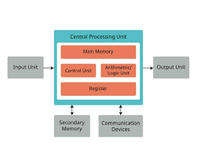

## Basics

#### Computer System Overview

- Input Unit
- Output Unit
- CPU (Central Processing Unit)
- Memory (Main/Primary Memory)
- Cache Memory
- Storage Unit
- System bus
###### Mobile System

###### Type of Softwares
- System Software
- Application Software
- Software Lib.

#### Data Representation
- Digital number systems.
- Decimal, Binary, Octal and Hexadecimal
###### Number Conversions
- Decimal ↔ Binary
- Decimal ↔ Octal ↔ Binary
- Decimal ↔ Hexadecimal ↔ Binary

###### Character/String Representation
- ASCII
- ISCII
- Unicode

