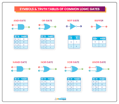

## Boolean Gates

 
- Logic decision which represents `YES (true) or NO (false)` is called a Binary decision.

#### Logical Operations:
- Truth table is a table which represents all the possible value of logical results of given combination of values.
- 

