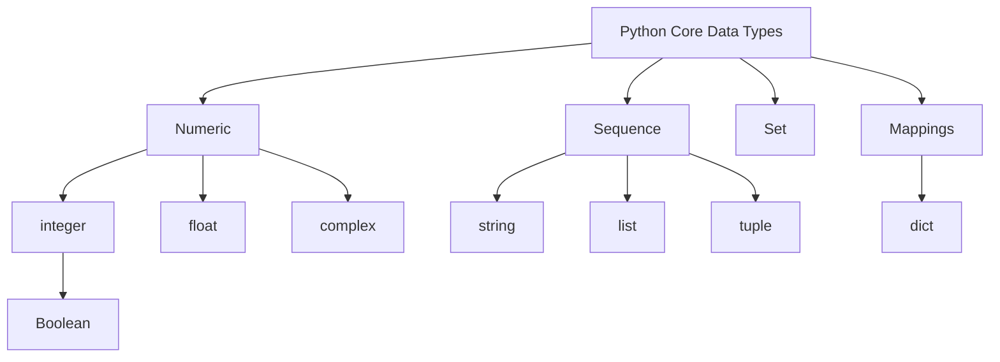

## Fundamentals

- Data Types
- Variables
- Operators & Expressions

#### Build-in core data types:

| S.No | Data Types  | Details                                                                 |
|------|-------------|-------------------------------------------------------------------------|
| 1    | Numbers     | Integers (signed, Boolean), Float, Complex Numbers                      |
| 2    | String      | Hold any types e.g., letters, numbers, and special characters           |
| 3    | List        | Compound data type – Mutable: `[1, 2, 3]`                               |
| 4    | Tuple       | Compound data type – Immutable: `(1, 2, 3)`                             |
| 5    | Set         | Does not allow duplicates: `{1, 2, 3}`                                  |
| 6    | Dictionary  | Key & Value pairs: `{'a': 1, 'b': 2, 'c': 3}`                           |

#### Operators:

| S.No | Operators  | Details                                                      |
|------|------------|--------------------------------------------------------------|
| 1    | Arithmetic | `+` `*` `// floor division` `** exponentioation` `-` `/` `%` |
| 2    | Unarry     | `+` `-` precedes an operand                                  |
| 3    | Binary     | Operator with two operand                                    |
| 4    | Augmented  | `+=` `-=`                                                    |
| 5    | Relational | `<` `>` `<=` `>=` `==` `!=`                                  |
| 6    | Identity   | `is` `is not` `in` `not in` `id() - returns memory address`  |
| 7    | Equality   | `==`                                                         |
| 8    | Logical    | `or` `and` `not`                                             |
| 9    | Chained    | `1<2<3 - Chained comparison operators`                       |
| 10   | Bitwise    | `&` `!` ` ^` `~`                                             |

