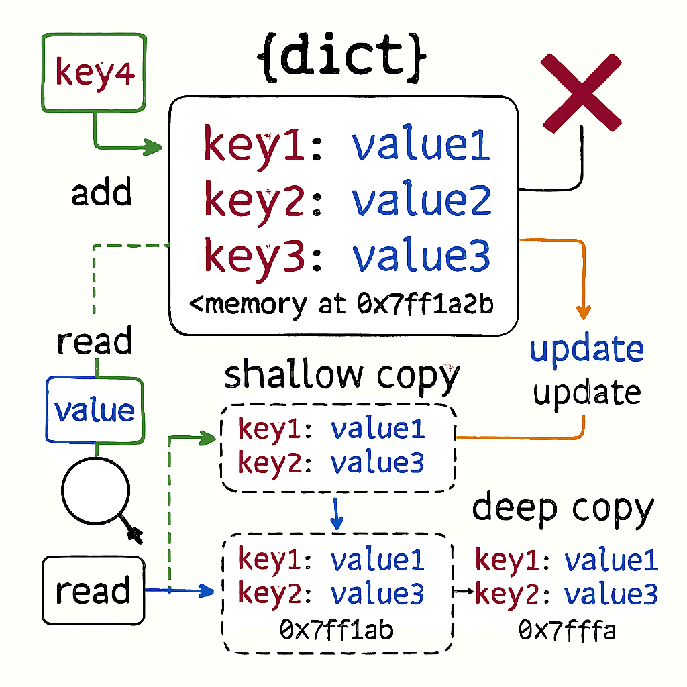

## Fundamentals:

- Create Dictionaries `Syntax: <dictionary> = {<key1>:<value1>, <key2>:<value2>...}`
- Access or Read Elements `Syntax: <dictionary>[<key>]`
 Examples: [Access Elements](2.access-elements.py)
- Multiple ways to creating dictionaries using Constructors: 
 `Syntax:` 
`1. basic_dict = dict({'key1': 'value1', 'key2': 'value2'})` 
`2. equal_dict = dict(key1='value1', key2='value2')` 
`3. list_dict = dict([('key1', 'value1'), ('key2', 'value2')])` 
`4. tuples_dict = dict((('key1', 'value1'), ('key2', 'value2')))` 
`5. zip_dict = dict(zip(['key1','key2'], ['value1','value2']))` 
 - `dict()` method to create a dictionary takes longer time compared to traditional method `{...}`  - It should be avoided until it becomes a necessity 
 - Examples: [Create - Multiple ways](1.create.py)  

### Characteristics of a Dictionary:
| S.No | Characteristics    | Details                                                 |
|------|--------------------|---------------------------------------------------------|
| 1    | Unordered Set      | No index associated in Dictionary                       |
| 2    | Not a Sequence     | Its Unordered Set of elements                           |
| 3    | Indexed by Keys    | Its Indexed by KEYS and Immutable                       |
| 4    | Keys are unique    | Key can't be duplicate, Values can be duplicated        |
| 5    | Values are Mutable | Modify values `<dictionary>[<key>] = <value>`           |
| 6    | Stored as mappings | Stored internally using `Hash`, linking called Mappings |

### 🔄 CRUD operations:

#### Adding Elements to Dictionaries `Syntax: <dictionary>[<key>] = <value>`
- Add new elements (key:value) using assignment as per syntax.
- Key being added must not exist in dictionary and must unique.
 Examples: [Add Elements](4.add-elements.py)

#### Nesting Dictionaries:
- Storing a dictionary inside another dictionary is called nesting of Dictionary.
- <b>Use case:</b> Students/Workers name and age, salary and other details
 Examples: [Nesting](5.nesting-dictionary.py)

#### Update/Modify existing Elements `Syntax: <dictionary>[<existing key>] = <value>`
- If Key already exists, the new value will be changed for the existing key.
- Make sure key must exist in the dictionary otherwise new entry will be added.
- Create dictionary interactively at runtime by accepting input from user
 Examples: [Add Elements](4.add-elements.py)

#### Deleting Elements from a Dictionary - `del, clear(), pop() and popitem()`:
- `del` - If key is not in the dictionary, it will raise the ERROR
- There is no way to specify own error message or value

| S.No | Options          | Details                                                                                                 |
|------|------------------|---------------------------------------------------------------------------------------------------------|
| 1    | del              | It's statement and won't return any values   `Syntax: del <dict>`   `Syntax: del <dict>[<key>]` |

- `pop()` - We can specify our own return value in the form of message or value

| S.No | Options          | Details                                                                                                                                                                   |
|------|------------------|---------------------------------------------------------------------------------------------------------------------------------------------------------------------------|
| 2    | pop()            | Remove and return removed value   `Syntax: <dict>.pop(key, <value>)`  `<value> -> Return value`                                                                   |
| 3    | popitem()        | Remove and return last inserted element <b>LIFO (Last In First Out)</b>   If dictionary empty, it will raise <b>KeyError   `Syntax: <dict>.popitem(key, <value>)` |
| 4    | clear()          | Remove all items from Dictionary  `Syntax: <dict>.clear()`                                                                                                            |

 Examples: [Delete items](6.delete.py)

#### Checking for Existence of a key `Syntax: <key> in <dict>` and `<key> not in <dict>` 
- To check whether a key is present in a dictionary called <b>Reverse Lookup</b>
- Don't apply on `values` of a dictionary
- `in` - Operator return `True` if the given `key` is present
- `not in` - Operator return `True` if the given `key` is not present

#### Pretty Printing a Dictionary `Syntax: json.dumps(<dict>, indent=<n>)`
- Printing output in more readable and presentable
- Need to import `json module` using statement `import json`

#### Counting Frequency of Elements `Syntax: <dict>.split()` and `<dict>.split(<delimiter>)`
- Create empty dictionary
- Read an element from the List using loop (`for loop`)
- Check if this element exists (condition) as akey in the dictionary (`if`)
- If not then add to dictionary in the form `<Key>`- Word :`<Value>`- Counts

#### Functions `Syntax: len(<dict>)` and Methods `<dict>.get()` , `<dict>.items()` , `<dict>.values()`
###### FUNCTIONS:
- `len(<dict>)` - Function <b>returns</b> length of the dictionary ie. count of elements `(key:value pairs)`.
###### METHODS: Accessing Items, Keys and Values
- `<dict>.get(key, [default])` - Method we can specify our own message through `[default]` arguments.
- `<dict>.items()` - Method returns all the items as <b>TUPLES</b> (sequence of key, value)
- `<dict>.keys()` - Method returns all the Keys in the form of <b>LIST</b>.
- `<dict>.values()` - Method returns all the Values as <b>LIST</b>, returned in on particular order.

#### Creating Dictionary from keys `Syntax: <dict>.fromkeys(<key seq>, [<value>])`
- Method is used to create a new dictionary from keys and common values which will be assigned to all the keys.
 Examples: [add elements from keys](1.create.py)

#### Extend/Update Dictionary with `Syntax: <dict>.setdefault(<key>, <value>)`  and `<dict>.update(<other dict>)`
- `<dict>.setdefault()` - To insert a new key:value pair and Returns the value, if added; otherwise returns value of the existing key.
- `<dict>.update()` - This method merges key:value pairs (existing key) or Add (new key), The items in the new dict are added to the old one and override any items already there with the same keys.

#### Making Shallow copy `Syntax: <dict>.copy()`

#### Sorted list of Keys and Values `Syntax: sorted(<dict>, [reverse = True])`
- Sorted by keys for sorting and returns a sorted LIST of the dictionary

#### Calculating `Syntax: max(<dict>)` , `min(<dict>)` and `sum(<dict>)`
- `<dict>` - is the dictionary whose max, min and sum of keys is to be calculated.
- Returns a value of Dictionary key's data types.