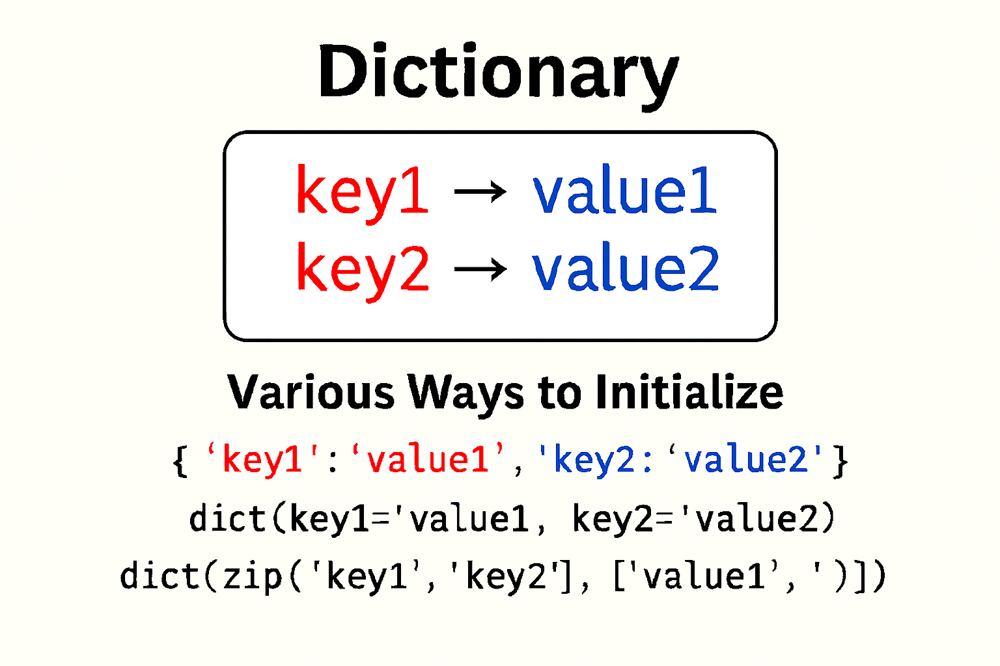

## Fundamentals:

- Create Dictionaries `<dictionary>[<key>:<value>, <key>:<value>...]`
- Access Elements: Ref: [Access Elements](2.access-elements.py)
- Multiple ways to creating dictionaries using Constructors: Ref: [Create - Multiple ways](1.create.py)
- [Characteristics of a Dictionary](#Characteristics)

### Characteristics:
| S.No | Characteristics    | Details                                                 |
|------|--------------------|---------------------------------------------------------|
| 1    | Unordered Set      | No index associated in Dictionary                       |
| 2    | Not a Sequence     | Its Unordered Set of elements                           |
| 3    | Indexed by Keys    | Its Indexed by KEYS and Immutable                       |
| 4    | Keys are unique    | Key can't be duplicate, Values can be duplicated        |
| 5    | Values are Mutable | Modify values `<dictionary>[<key>] = <value>`           |
| 6    | Stored as mappings | Stored internally using `Hash`, linking called Mappings |

### 🔄 CRUD operations:

<b>Create:</b> Create a new key-value pairs. 
`1. basic_dict = {'key1': 'value1', 'key2': 'value2'}` 
`2. equal_dict = dict(key1='value1', key2='value2')` 
`3. list_dict = dict([('key1', 'value1'), ('key2', 'value2')])` 
`4. zip_dict = dict(zip(['key1','key2'], ['value1','value2']))` 
`5. tuples_dict = dict((('key1', 'value1'), ('key2', 'value2')))` 

<b>Add:</b> Adds a new key-value pair. 

<b>Read:</b> Highlights access to a specific key.

<b>Update:</b> Replaces a value and shows the new memory address.

<b>Delete:</b> Removes a key-value pair and removes all items.

<b>Copy:</b> Shows a shallow copy with identical memory references.

#### Adding Elements to Dictionaries:
- Add new elements (key:value) using assignment as per syntax.
- Key being added must not exist in dictionary and must unique.

Ex: `<dictionary>[<key>] = <value>` 
Ex: Ref: [Add Elements](4.add-elements.py)

#### Nesting Dictionaries:
- Storing a dictionary inside another dictionary is called nesting of Dictionary.
- Ref: [Nesting](5.nesting-dictionary.py)

#### Update/Modify existing Elements:
- If Key already exists, the new value will be changed for the existing key.
Ex: `<dictionary>[<existing key>] = <value>` 
Ex: Ref: [Add Elements](4.add-elements.py)

#### Deleting Elements from a Dictionary:

| S.No | Options            | Details                                                                                         |
|------|--------------------|-------------------------------------------------------------------------------------------------|
| 1    | del()              | It will not return any values   `del <dict>`   `del <dict>[<key>]`                      |
| 2    | pop()              | Remove and return removed value   `<dict>.pop(key, <value>)`  `<value>` - Return values |
| 3    | popitem()          | Remove and return last inserted element   `<dict>.popitem(key, <value>)`                    |
| 4    | clear()            | Remove all items from Dictionary  `<dict>.clear()`                                          |

Ex:
 [Delete items](6.delete.py)

#### Checking for Existence of a key `<key> in <dict>` and `<key> not in <dict>` :

#### Pretty Printing a Dictionary `json.dumps(<dict>, indent=<n>)`:

#### Counting Frequency of Elements `<dict>.split()` and `<dict>.split(<delimiter>)`:

#### Functions `len(<dict>)` and Methods `<dict>.get()` , `<dict>.items()` , `<dict>.values()`:

#### Creating Dictionary from keys `<dict>.fromkeys(<key seq>, [<value>])`:

#### Extend/Update Dictionary with `<dict>.setdefault(<key>, <value>)`  and `<dict>.update(<other dict>)`:

#### Making Shallow copy `<dict>.copy()`:

#### Sorted list of Keys and Values `sorted(<dict>, [reverse = True])`:
- Sorted by keys for sorting and returns a sorted LIST of the dictionary

#### Calculating `max(<dict>)` , `min(<dict>)` and `sum(<dict>)`:
- `<dict>` - is the dictionary whose max, min and sum of keys is to be calculated.
- Returns a value of Dictionary key's data types.