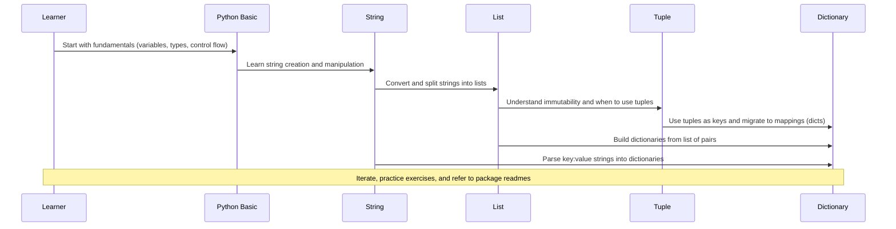

# kiruthick-python

A small collection of Python examples and exercises organized by concept and package. This repository groups learning material and code for Python basics, string operations, lists, tuples and dictionaries.

## Package Index

This index lists the learning packages and example files in this repository. Each package focuses on a core Python concept and contains small example scripts, exercises, and an explanatory README.

1. [1-basics](1-basics/README.md) — Basics: Core fundamentals — variables, data types, control flow (if/else), loops (for/while), functions, basic I/O.
2. [2-boolean-gates](2-boolean-gates/README.md) — Boolean Gates: Boolean logic, truth tables, and logical operators.
3. [3-data-handling](3-data-handling/README.md) — Data Handling: File I/O, CSV parsing, basic data transformations and common utilities.
4. [4-modules](4-modules/README.md) — Modules: Creating and using modules and packages, standard library highlights.
5. [5-flow-controls](5-flow-controls/README.md) — Flow Controls: Conditional statements, loops, and exception handling patterns.
6. [6-string-manipulation](6-string-manipulation/README.md) — String Manipulation: String methods, formatting, slicing, and parsing patterns.
7. [7-list](7-list/README.md) — Lists: Building and manipulating lists, comprehensions, nested lists, and common algorithms.
8. [8-tuples](8-tuples/README.md) — Tuples: Immutable sequences, packing/unpacking, and tuple use-cases.
9. [9-dictionary](9-dictionary/README.md) — Dictionaries: Mapping types, creation patterns, dictionary methods, and nested structures.
10. [10-ethics](10-ethics/README.md) — Ethics & Fundamentals: Intellectual property, plagiarism, open source philosophy, and societal impacts.

## Concept flow

Below is a mermaid sequence diagram that represents how a learner might progress through the core concepts in this repository (Python Basic -> String -> List -> Tuple -> Dictionary).

## How to use

1. Browse the package folders and open the README or example scripts.
2. Run example scripts locally using Python 3.x: `python3 path/to/example.py`.
3. Each package contains focused explanations and sample code.
4. Try small edits and rerun to learn by experimentation.

## Contributing

Contributions welcome — open issues and PRs to add examples, fixes or explanations.

## Next ideas / TODOs

- Add focused READMEs inside each package with short exercises and expected outputs.
- Add unit tests for examples (pytest) and a CI workflow to run them.
- Add more intermediate/advanced packages (file handling, modules, OOP, exceptions).
